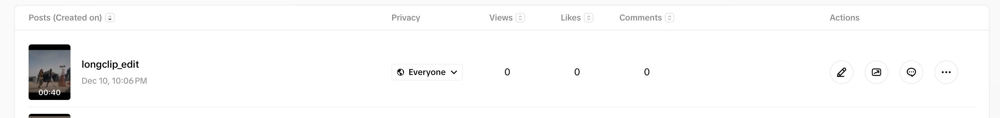

## Chema Galvez 

#### 1. Platform Copyright Policy Analysis
For the assignment the platform I chose was TikTok

- **How does the platform detect copyrighted content? (automated systems like Content ID, manual reporting, etc.)**

    Users that believe their copyright has been infringed can manually submit a Copyright Infringement Report to request the removal of the alleged infringing content from TikTok through an online form ([TikTok Copyright Guide](https://support.tiktok.com/en/safety-hc/account-and-user-safety/copyright)).

    Although I did not find any mention of this in the official documentation, webpages like CapCut and Screenapp mention the use of automated systems, more specifically using Content ID to instantly detect copyright infringements ([Screenapp - How to Check Copyright Video Before Uploading on TikTok: Complete 2025 Guide](https://screenapp.io/blog/how-to-check-copyright-video-before-uploading-on-tiktok)) ([CapCut - How to Avoid TikTok Copyright: Stay Safe from Flags and Mutes](https://www.capcut.com/resource/tiktok-copyright#How%20to%20detect%20TikTok%20copyright%3A%20In-app%20setting)).

- **What happens when content is flagged as potentially infringing?**
    
    Again, I did not find direct mention of this in TikTok's official documentation but a post in Wondershare ([How to Check TikTok Video Copyright Before Posting: A Step-by-Step Guide](https://filmora.wondershare.com/tiktok/check-tiktok-video-copyright-before-uploading.html)) mentions that if Content ID detects a copyright infringement the platform mutes the video or takes it down entirely. In cases where the copyright infringement happens in the preprocessing of the media, TikTok would even prevent it from uploading.

    On the official TikTok guidelines ([TikTok Copyright Guidelines](https://support.tiktok.com/en/safety-hc/account-and-user-safety/copyright)) mentions that after a manual Copyright Infringement Report an Intellectual Property (IP) specialist will review the case and reach a verdict. If the IP specialist does find an infringement they will take down the content and notify both reporter and reported person.

    Each binding copyright infringment is marked as a strike. If the user has 3 strikes the account will permanently removed.

- **What is the appeals or counter-notification process?**

    After the notification to both parties, the reported person can appeal by going to a provided link in the notification, fill all the required information, including contact information and prove to support the claim that the user is authorized to use the copyrighted material or that the user has the right to use the content ([TikTok Copyright Guidelines](https://support.tiktok.com/en/safety-hc/account-and-user-safety/copyright)).

- **How does the platform handle monetization of content containing copyrighted material?**
    According to the [Creator Rewards Program Guideline](https://support.tiktok.com/en/business-and-creator/creator-rewards-program/creator-rewards-program) content that has copyright material is not eligible to be monetized. 

- **Are there any special programs (e.g., YouTube's Content ID licensing agreements)?**

    TikTok has licensing and agreements with major music right holders like the
    Commercial Music Library (CML) where users have access with a pre-cleaned music library featuring content that has licensing partnerships with TikTok, making it risk-free to use this content ([Turning up the volume on the TikTok Commercial Music Library with the Artist Impact Program](https://newsroom.tiktok.com/commercial-music-library?lang=en)).

Compare the platform's stated policy with the behavior you observe in your experiments (Tasks 2 and 3).

#### 2. Fair Use Experiments

- **Raw copyrighted clip** I used a fight scene of the movie Superman (2025) that includes copyrighted music. So in this case is both the audio and the video that are copytright infringement 

Before even uploading anything, TikTok prompts me to enable automatic music copyright content checks, being consisten on what I found in the previous mentioned posts 

For this excersise I did not enable this feature. Only (because I had to) the Content check lite, which automatically checks the content against the Community Guidelines.

The shortclip (5 seconds) was updated on Wednesday December 10th at 12:45 pm. https://www.tiktok.com/@user78163605067817/video/7582302074931612983

The longclip (1:07 minutes) was updated on Wednesday December 10th at 1:22 pm.
https://www.tiktok.com/@user78163605067817/video/7582311650963836215

- **Educational use**: I trim the longclip and added some educational images to talk about the story and powers of the superhero fighting (Mister Terrific). The original audi stayed but I transformed the videoclip by adding textblock images talking about the character. Educating people on what they are seeing.

This video was uploaded on Wednesday December 10th at 7:54 p.m
https://www.tiktok.com/@user78163605067817/video/7582412875390651703

By end of day neither of my copyright material had been flagged so I tried uploading a 40 second clip with the Automatic Music copyright check enable to see if that would catch the copyrighted music in the movie scence

And the Automatic tool did not detected any copyright check even though I am uploading a video with a song that I don't have the rights to use.

This video was uploaded December 10th 10:06 PM https://www.tiktok.com/@user78163605067817/video/7582446820970810637

**At December 12 01:05AM, more tha 36 hours after the first upload TikTok has not flagged any of the videos for Copyright Infringment.**

#### 3. AI-Generated Content Investigation

- **Direct reference**: I prompt Suno "A song really close, almost identical to Kendrick Lamar's "luther (with SZA)" using Jay-Z voice" but it was not generated since I got the message "Your tags contain artist name jayz - we don't reference specific artists on Suno, please change your tags and try again"

- **Style mimicry**: But when I changed the prompt to "In the style of Jay-Z's Empire State of Mind song, create a song about Chicago" and added a lyrics prompt:
"In Chicago concrete Jungle were dreams are made of there's nothing you can do  in Chicago, seeing the riverwalk". In this case the song was generated but it is nothing similar to either Jay-Z's style or to Empire State of Mind beat. 

    Then, when I tried to download the song I got the disclaimer that if I wanted to use the song for commercial use I had to upgrade to the Pro version. Implying that any content created is property of Suno and the only way to have the right to it is by paying Suno.

    
Here you can hear the AI song (sorry about the cringe :D ):
[Chicago concrete jungle](screenshots/In_Chicago_concrete.mp3)

- **Original creation**: To create an original song with Suno I used the prompt "Original song that talks about seeing the fireworks in Chicago's Navy pier pop style". And once again I got the disclaimer that I can't use the song for commercial purpose unless I upgrade my Suno.

Once again I have to apologize for the cringe song:
[Fireworks at Navy Pier song](screenshots/Fireworks_atNavy_Pier.mp3)

- Research findings:
  - **What does the AI tool's terms of service say about copyright?**
  
    According to [Suno's Terms of Service](https://suno.com/terms-of-service), Suno remains the owner of any music the system generates for the user, and the user is only permitted to use that output for personal, non-commercial purposes with attribution. However, for Pro or Premier users, Suno assigns ownership rights in the output DURING THE PAID SUBSCRIPTION PERIOD. It's important to note that Suno makes no guarantee that the output is eligible for copyright protection because current U.S. copyright law generally requires human authorship, Suno warns that fully AI-generated music may not qualify for copyright registration, regardless of who owns it.
  
    In addition to assigning ownership to paid users, the Terms state that any content uploaded or submited, including lyrics, audio, or prompts is automatically licensed to Suno under a broad, worldwide, perpetual, royalty-free license. Suno can use the submissions to operate and improve its services, including training models, and can distribute or modify the content as needed. The company can also display the output publicly, identify that it was generated with Suno, and allow other users to access or remix it when features permit. If the song becomes available publicly, such as on Discord, other users may download, modify, and reuse it unless the user changes their privacy settings.
  
    The Terms also clarify that, because of how machine learning works, Suno may generate identical or highly similar songs for different users, and if that happens, the user owns their separately generated output. Moreover, remixes created by other users are jointly owned by both parties if copyright applies at all, but even then they can only be used non-commercially.
  
    Finally, the Terms include a standard DMCA notice process, meaning Suno will accept copyright infringement complaints and take action when applicable, even though some AI outputs may not be copyrightable.

    
  - **Who owns the copyright to AI-generated content? (you, the AI company, the creators of training data, public domain/no one?)**

    Suno mentions in their [FAQ page](https://help.suno.com/en/articles/2746945) that for the free plan Suno owns the songs and the user can use them only non-commercially. But if it's a Pro plan user, then Suno transfers ownership of the output to the user giving commercial license i.e. the user can distribute, upload to Spotify/YouTube/etc and collect revenue.

    However, in the U.S., copyright requires “human authorship” thus if the song is generated 100% by AI the U.S. Copyright Office won’t register it. And Suno mentions that writing a prompt is not enough to count as authorship. But if the user wrote the lyrics, then they can copyright them.

    This distintion is key because licensing (like Suno's) only works when platforms like YouTube/Spotify/TikTok choose to honor them but if a platform chooses not to agree to this licensing then the holder has no power legally to make any claims
    
  - **What is your platform's stated policy on AI-generated content?**

    I did not found any information on [TikTok's Term of Service](https://www.tiktok.com/legal/page/us/terms-of-service/en) but there's a [Support Article about AI-generated content](https://support.tiktok.com/en/using-tiktok/creating-videos/ai-generated-content) that mentions that creators are encouraged to label content that's been completely generated or significantly edited by AI and required for AI-generated content containing realistic images, audio, or video. In this case, "Significantly edited" means things like making someone appear to do or say something they didn't, or substantially altering their appearance (e.g., face-swaps)
    
    There's also Prohibited AI content (even if labeled) like:

    (1) Fake authoritative sources or crisis events.
    
    (2)Public figures being shown as bullied or making/receiving endorsements.
    
    (3) AI-generated likenesses of minors under 18.
    
    (4) Likenesses of private adults used without permission.

#### 4. Legal Analysis

Apply what you've learned about copyright law to your experiments:

- **Fair Use Four Factors**: 

    Video 1 - Raw Short Clip: 

    (1) *Purpose and character of the use (transformative? commercial?).* 
    This factor weighs strongly against fair use. The clip is a direct reproduction showing the same content for the same purpose (entertainment). There is no commentary, criticism, parody, or any new meaning added. While the use is non-commercial, which helps slightly, non-commercial use alone doesn't make something fair use.

    (2) *Nature of the copyrighted work (creative vs. factual?)*
    This factor weighs against fair use. Any movie has significant artistic expression in cinematography, choreography, visual effects, and original score. Copyright protection is strongest for creative works like this compared to factual works like news footage or documentaries.
    
    (3) *Amount and substantiality used.*
    This factor is mixed. Quantitatively, 5 seconds is a tiny fraction of a feature film which helps. However, qualitatively, a climactic fight scene with signature music may represent "the heart" of the work. Courts have found infringement even for short clips when they capture the most valuable or memorable portions.
    
    
    (4) *Effect on the market for the original.*
    This factor weighs against fair use. The clip could substitute for licensed promotional materials or clip licensing. Studios monetize memorable scenes through official channels. While 5 seconds likely won't replace ticket sales, it contributes to a broader ecosystem where unauthorized clips circulate freely, potentially harming the market for authorized uses.

    Video 2 - Raw Long Clip: 

    (1) *Purpose and character of the use (transformative? commercial?)*
    This factor weighs strongly against fair use. Identical analysis to Video 1.

    (2) *Nature of the copyrighted work (creative vs. factual?)*
    This factor weighs against fair use. Same as analysis as Video 1.
    
    (3) *Amount and substantiality used*
    This factor weighs against fair use. Quantitatively, 1:07 is substantially more than the 5 second clip. While still a small percentage of a full film, it's a meaningful excerpt. Qualitatively, a full minute of a fight scene almost certainly captures significant creative expressions. This is enough to deliver substantial entertainment value independent of the full film.
    
    (4) *Effect on the market for the original*
    This factor weighs more strongly against fair use than Video 1. A 67 second action sequence provides significant standalone entertainment value. This directly competes with official clip releases, trailers, and licensed content. Viewers may feel less urgency to see the film if key action sequences are freely available. The longer duration increases potential market harm.

    Video 3 - Educational Video with Voiceover and Text: 

    (1) *Purpose and character of the use (transformative? commercial?)*
    This factor weighs in favor of fair use. The video is transformative to a meaningful degree since the purpose changed from entertainment to education. A voiceover commentary provides context not in the original, text overlays explain the character's comic book origins, and the audience's experience shifted from "watching a fight" to "learning about a superhero." The use is non-commercial which supports fair use. The film shows Mister Terrific in action while this video teaches viewers who he is. This is the kind of new purpose courts recognize as transformative.

    (2) *Nature of the copyrighted work (creative vs. factual?)*
    This factor weighs against fair use. The source material remains a creative fictional film. This factor is inherent to the original work. However, this factor is often less decisive when strong transformation exists.

    (3) *Amount and substantiality used*
    This factor weighs in favor of fair use. The clip was trimmed rather than using the full 67-second version. The editing shows only what was necessary to illustrate the educational points. Courts favor defendants who demonstrate restraint and take only what their transformative purpose requires. The voiceover and text overlays mean the clip functions as illustration for the commentary rather than as standalone entertainment.
    
    (4) *Effect on the market for the original*
    This factor weighs in favor of fair use. The video serves a different market, people wanting to learn about Mister Terrific's backstory. It doesn't substitute for watching the film or purchasing official content. Educational content about comic book characters doesn't compete with theatrical releases. If anything, it might drive interest in seeing the film.
    
    Although I have to mention that the original copyrighted music remains in the video without any commentary on the music itself. This creates a secondary infringement issue separate from the video footage.

    Video 4 - 40 second clip with Auto-Check enabled: 

    (1) *Purpose and character of the use (transformative? commercial?)*
    This factor weighs strongly against fair use. Identical to Videos 1 and 2 is a pure reproduction with no transformation.
    
    (2) *Nature of the copyrighted work (creative vs. factual?)*
    This factor weighs against fair use. Same as all other videos, highly creative work with strong copyright protection.
    
    (3) *Amount and substantiality used*
    This factor weighs against fair use. 40 seconds falls between the other raw clips. It's substantial enough to deliver meaningful entertainment value from the fight scene and music, and likely captures qualitatively significant portions of the creative expression.
    
    (4) *Effect on the market for the original*
    This factor weighs against fair use. Same analysis as Videos 1 and 2, competes with licensed clips and official content distribution.

- **Gap Analysis**:

    More than day and a half has past and my videos are still up, revealling the practical reality of copyright enforcement. The law provides strong rights, but enforcement depends entirely on rights holders actively monitoring platforms, detection systems being comprehensive, and someone choosing to file a complaint.

    The Superman clips are technically infringing (assuming no fair use defense), but without detection or a complaint, nothing happens. This creates a de facto "enforcement lottery" where identical content might be removed from one account but stay up indefinitely on another, depending on timing and detection quirks.

    Also I've been thinking if new content is harder to detect. Using a 2025 film may have avoided detection simply because the content isn't yet in reference databases, a timing-based loophole rather than a legal one.
